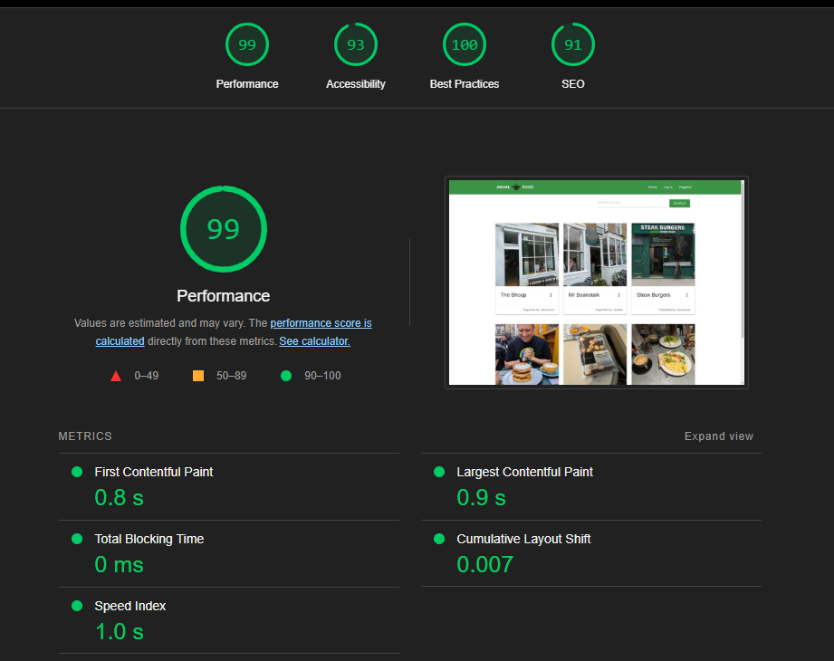

# Angel Food

## A Restaurant Review Site
This is a website designed to demonstrate my ability to use databases, specifically MongoDB. It is a restaurant review website aimed at my local area of Angel, Islington, and is designed to be used by anyone locally. It has functionality for desktop, but primarily it is envisioned as something used on a smartphone, and includes the ability to add a picture taken by a smartphone camera.

## Concept
There are a great many review websites, and a great many ways to find local eateries or cafes. I make no claims to have invented something truly innovative, but I have certainly created something that is personal to me and to the people I live near. Angel has a great many places to eat and drink, and I wanted to call that out as well as demonstrating that I can use databases.

## User Story
As a user, I want:
+ An app that showcases local food and drink
+ Strong visual style
+ CRUD functionality for places
+ To be able to see places I have submitted
+ Search ability

As an admin, I want, in addition to the previous points:
+ CRUD functionality for cuisine types

## Features and Wireframe
This site comprises several pages linked together with Jinja templating. Common features on each page are the header and footer. The header changes depending on whether you are logged in or out, and whether you are an admin or not.

The images presented here are not final, and are indicative of what a user might see at the point in prototyping that this section of the Readme was written. Colours and designs are not final and are subject to change after prototyping and user testing.

### Main Page


This page has the basic cards that display information about a place; a menu with options to view the user's places, to add a place, or logout; and a footer. The header and footer are common to all pages. Note that the currently-logged-in user is not an admin - admin users have extra privileges, detailed below. Cards would have edit and delete buttons, visible only for the places that the currently-logged-in user made.

### Add A Place


This page has a form that sends the information about a new place to the database. Information collected here includes the name of the place, its type of cuisine (Japanese, Italian, Mexican etc) as a dropdown, the average price per person as a dropdown, the review headline, review text, and whether it does takeaway or not as a toggle. There is the ability to add an image, and the submit button. Not detailed is an 'Edit a place' page, which is identical except that the details from the database are already filled in, and the title is different.

### Log In


This page has a basic login interface. Users can log in by inputting their username and password, which is stored on the database and protected by random symbols in the password. Note that the menu has changed to a non-logged-in variant - 'My Places' and 'Add a place' have both gone, replaced with 'Login' and 'Register'.

### Register


Almost identical to the Log In page with the exception of requiring an email. I would like to have a 'forgot password' functionality, as it's something that I feel all websites should have. An email address would be vital to this feature.

### Manage Cuisines


This page would be for admin only so that they can add new cuisines, or modify the existing ones. Each card would have an 'edit' and 'delete' button. This page is only visible to admin users; note the added menu options at the top indicating that this user is an admin.

### Entity Relationship Document


## Upcoming features
+ Google Maps integration - I would like to add the ability to select the place you are reviewing on Google Maps and either link to the Maps app on a phone or have a map onscreen.
+ It's come to my attention subsequently that Flask has its own login functionality, which might have streamlined the process. As well, the 'forgot password' functionality works, but currently uses my own email address to send the emails, so having this set up to use a 'business' email would be useful. For the purposes of this project, though, it's not necessary.

## Technology
+ This website was made in its entirety using Gitpod Workspaces
+ Databasing is provided by MongoDB
+ Deployment is from Heroku
+ Images are handled by Cloudinary
+ Wireframe and prototyping images were made in Figma
+ Additional software used to create this website include Photoshop for image editing and Firefox for previewing, inspecting and bug testing, as well as Chrome for the Lighthouse report

## Testing
### Test Case: Main Page (not logged in)
+ Clicking on images/three dots opens up information about places
+ Images are displayed in blocks of 3 on desktop, 2 on tablet, 1 one smartphone
+ Edit and Delete buttons are not displayed
+ Menu at the top contains only Home, Login and Register
+ Attempting to access any other page via manually typing in URL redirects to Login page, as seen here:


+ Attempting to access any Admin-controlled areas of the site gives the following 403 error:


+ Attempting to access a specific record that is admin-controlled (to edit a cuisine type) gives the same message; in this image, I'm logged out, but the same result applies if I'm logged in as a non-admin account:


### Test Case: Login
+ All fields are required
+ Incorrect password format gives the following error:


+ Incorrect username OR password gives the following error:


+ Correctly putting in both username and password logs the user in
+ Clicking 'forgot password' correctly begins the 'forgot password' flow, ending in the user being sent an email to change their password

### Test Case: Register
+ All fields are required
+ Cannot type beyond maximum character limit of fields
+ Mismatched passwords prevent Register button being clicked:


+ Attempting to sign up as an existing user gives following error:


+ Correctly filling in form does send user to the front page, now logged-in

### Test Case: Add Place
+ All fields are not required
+ Adding text beyond the character limit is not possible
+ Adding an image works as intended
+ Adding no image adds a default image instead called no_image.png to maintain quality of main page


### Test Case: Edit Place
+ All fields are prefilled with database information
+ All fields can be edited and saved
+ Cancelling out of this returns the user to the previous screen

### Test Case: My Places
+ Places are navigable and interactable in exactly the same way as the front page
+ Only the currently-logged-in user's places are available
+ Attempting to navigate to another user's profile does not load the places, but instead remains on the current page
+ Delete button pops up a confirmation modal. Clicking anywhere but on the 'Confirm' button exits the modal and does not action the delete

### Test Case: Cuisines
+ Only accessible if you are logged in as admin
+ Clickable 'Edit' and 'Delete' buttons function as expected
+ Delete button pops up a confirmation modal. Clicking anywhere but on the 'Confirm' button exits the modal and does not delete the cuisine

### Test Case: Add Cuisine
+ The only field on this page is required
+ Adding text beyond the character limit is not possible
+ Adding an image works as intended
+ Adding no image adds a default image instead called no_image.png to maintain quality of main page

### Test Case: Edit Cuisine
+ The field is prefilled with database information
+ Cancelling out of this returns the user to the previous screen

### Log Out
+ Log out functionality works, immediately logging the user out and returning them to the front page

### Bugs discovered
+ Properly aligning icons in buttons proved to be a challenge, and also to the 'takeaway' toggle. I ended up having to provide some very specifically-targeted CSS for the takeaway toggle
+ The default text on the 'create place' interface is in three different types of grey - black for the dropdowns, light grey for the image, and mid-grey for the remaining fields. Despite extensive effort, I've not been able to change this.
+ Late in the production process, some changes I made meant that the first card of a new row rendered on the right hand side rather than the left. This was introduced while adding the 'display placeholder image if none is provided' code; ultimately this was fixed by modifying the CSS. Following this, I rechecked the CSS and the app.py using the Code Institute linter, with both still passing with no errors.

## Code validation

### Lighthouse Report:


### <a href="https://pep8ci.herokuapp.com/#" target="_blank">Code Institute Linter</a>


### <a href="https://jshint.com/" target="_blank">JSHint</a>


### <a href="https://validator.w3.org/" target="_blank">W3C</a>


### <a href="https://jigsaw.w3.org/" target="_blank">Jigsaw</a>


## Supported Screens and Browsers
+ This website works in any browser and at any screen size, from desktop down to smart phones.
+ It has been developed and tested for Firefox, and smaller screen sizes have been simulated with Firefox's Inspect tool. Sample screens of all currently-available smart phones have been tested through Firefox's Inspect tool. It has also been tested natively on a Pixel 7a device and a Pixel 6 Pro.


## Deployment
This website has been deployed on Heroku, the deployment for which is available at https://angel-food-3a8bebdae07e.herokuapp.com/. It was developed using the Code Institute full template repository, available at Github. It can also be deployed locally on your machine.

To view the deployment on Heroku:

+ Navigate to https://angel-food-3a8bebdae07e.herokuapp.com/

To clone the repository from Github in your editor of choice:

+ First, open your terminal.
+ Change the current working directory to the location where you want the cloned directory.
+ Input: ```bash
+ Input: cd path/to/your/directory (ensure you change the directory to whatever you want to clone the repository)
+ Clone the repository by running: git clone https://github.com/stevecook23/angel-food.git
+ Change directories into the cloned repository: cd angel-food

Now you have a copy of the source code and can start to work on it. Bear in mind that the contents of the .env file, or the environment variables throughout the project, will not be publicly available - you will need to provide this file and these details yourself.

To deploy the site locally on your machine, after you have cloned the repository from Github, please do the following:

+ Open your terminal
+ Input: python3 app.py
+ You will see several lines of text, including 'Running on' and an address
+ Ctrl-click the address, or copy it into your browser of choice

You should now be able to view the app locally.

## Credits
### Text Content
Text is provided by users of the site

### Media
All media on this site is taken by users in the process of adding places or created by me. No stock images have been used.
